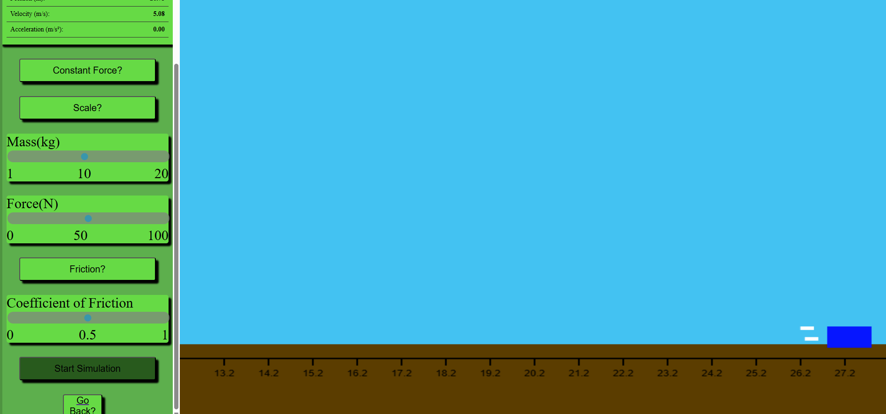
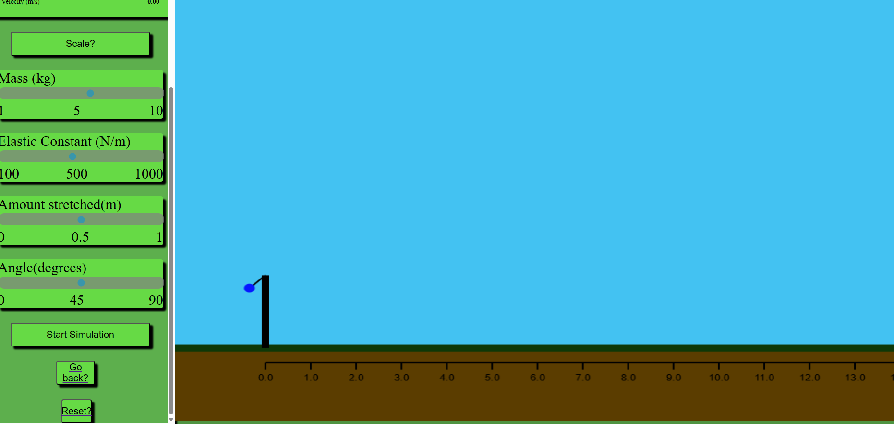
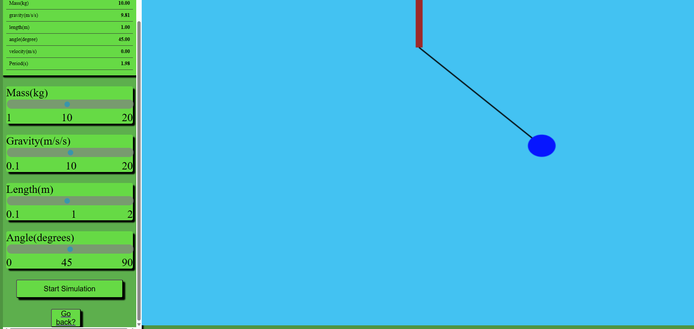
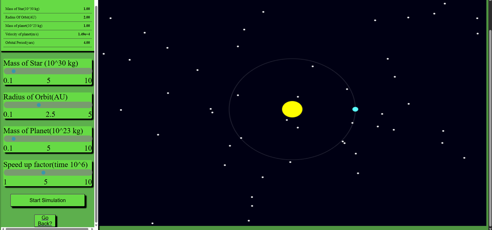

# Physics Stuff Website
This is a website that I made to simulate different physics experiments. You basically change different parameters and then watch the result play out.

## Kinematics

This simulates forces acting on the block, and you can see things like acceleration and velocity.

### Force

Pretty self explainatory, if constant force is pressed there will always be a force acting on the clock to the right, otherwise the force will be applied for one second once you start the simulaiton. Use the force slider to change the magnitude of the force

### Friction 
If the button is clicked friction will act on the block, with the slider determining the coefficient of friction

## Projectile Motion

This was honestly one of my favorite ones to code. There is a ball attatched to a slingshot, and once you press start simulation is starts moving in projectile Motion

### Angle
This is the angle between the elastic and the base of the sling 

### Elastic constant
This is the constant of the elastic band holding the ball back 

### Stetched
This changes how fas back the elastic is stretched with the ball.

## Pendulum

This simulates the pendulum under gravity. There is no friction in the simulation, and is basically a demo of simgle harmonic motion
### Angle
This is the degree from the vertical

### Gravity
This changes the acceleration due to gravity for the pendulumn;

## Length
This changes how long the link connected to the pedulum

## Orbits

This simulates the orbit of a planet around a star, if the orbit is of a certain radius, and assuming that the orbit is perfectly circular

## Speed
The actual orbit time is usually multiple years so I multiplied the time by 10^6. You can change the speed to multiply that further, to speed up or slow down the planet's orbit on the screen.(Does not affect the calculation)
